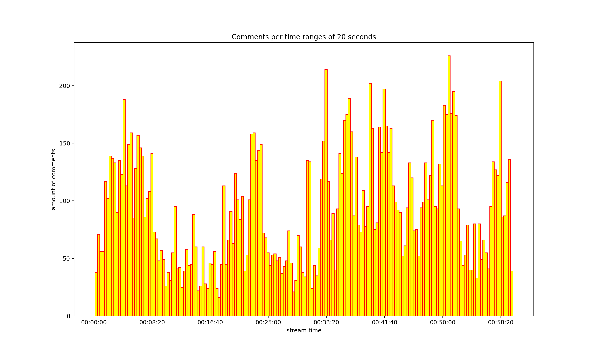
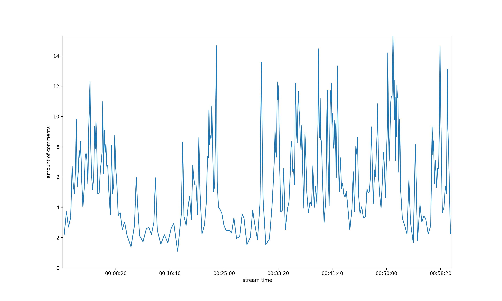

# Twitch comments graphs

## Use it :

1. Add your own Client-ID from [Twitch Dev Console](https://dev.twitch.tv/console/apps) to the ```TWITCH_CLIENT_ID``` constant in ```main.py```
2. Run the ```analyse``` function with the following params:
    - ```videoId```: (**int**) The ID from the Twitch Video. ex: *https://www.twitch.tv/videos/__618460248__*
    - ```startTime```: (**int**) The start of the part of video you want to analyze (in seconds)
    - ```startTime```: (**int**) The end of the part of video you want to analyze (in seconds)
    - ```graphType```: (**string**) The type of matplotlib you want. Available values : **'hist'**, **'line'**.
    - ```accuracy```: (**int**) The time range (in seconds) in which the part analysed will be divided

*Note :* Sometimes the process can be long, especially when the time range is wide because comments usually come in packets of length 40 < n < 60

<br>

## Libraries used :
* matplotlib :  ```pip install matplotlib```
* requests :  ```pip install requests```

<br>

## Examples : 



